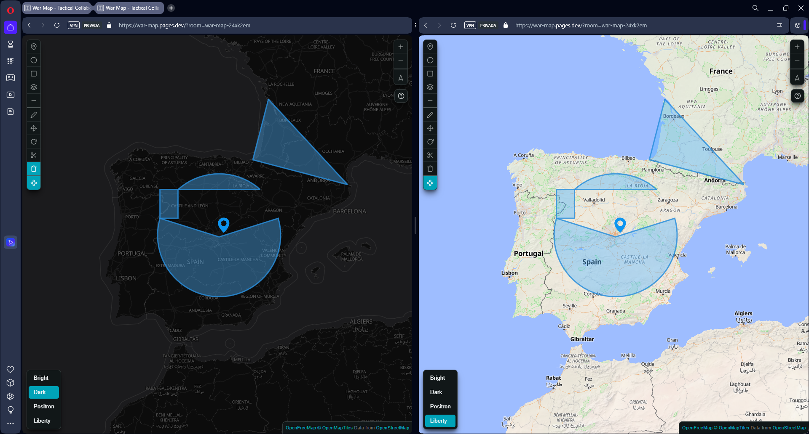

# War Map Drawer

A simple web app for drawing on maps. Built with Svelte and deployed on Cloudflare Pages.



## How it works

The app uses peer-to-peer (P2P) rooms for real-time collaboration. Each room has a unique ID that's included in the URL, allowing multiple users to join the same drawing session by sharing the link.

Currently it only works between tabs of the same browser, as the signaling servers have been discontinued.

## Features

- Interactive map interface
- Drawing tools (lines, shapes, markers)
- Keyboard shortcuts for efficient drawing (see [KEYBOARD_SHORTCUTS.md](docs/KEYBOARD_SHORTCUTS.md))
- Collaborative features via P2P rooms

## Getting Started

```sh
pnpm install
pnpm run dev
```

## Deployment

See [DEPLOYMENT.md](DEPLOYMENT.md) for deployment instructions.
